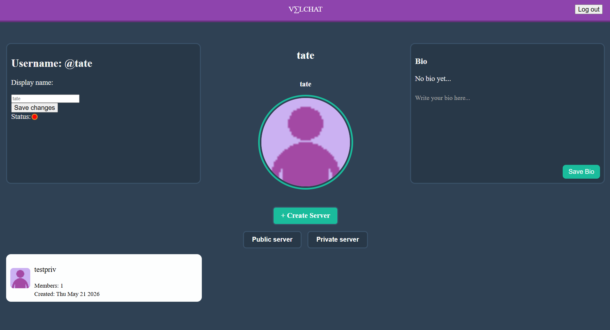
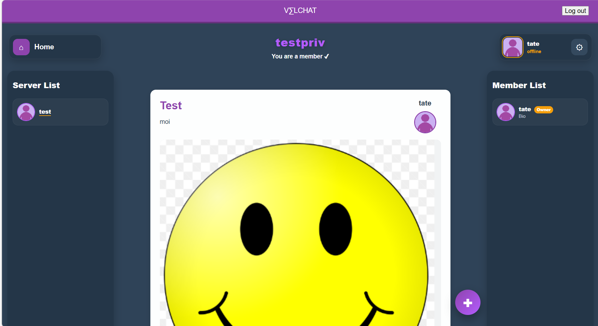

Velchat

Velchat on nettissä oleva forum jossa käyttäjät voivat puhua toisilleen ryhmien ja postauksien kautta. Kun liityt/luot ryhmän käyttäjät voivat tehdä postauksia, kommentoida postauksiin ja äänestää jos tykkää tai ei tykkää postauksesta.

---

Teknologiat

Käytettiin chatgpt ja claude virheiden korjauksessa jos sitä ei osattu itse selville.

---

Omat vastuut

Tate: Minä tein pääosin ryhmien luomisen ja selauksen mutta tein myös pienempiä bugi korjauksia. Tein myös Eliaksen kanssa moderointityökalut.
Nicolas:
Elias:
Noah: Minä tein rautalankamallia ja suunnittelua. Tein homepage.ejs ja tein sen css ja media sscreen. Korjasin myös tyyli bugit ja näytin ne muille ryhmäläisille.
Eero: Mitä tein sivujen rangat ja suunnitelua. Tein myös post toiminnon eliaksen kanssa sekä katsoin kaikki sivun bugit ja reportoin niistä tiimille.

---

Projektin tärkeimmät osuudet

Servereiden luominen ja niiten toimivaisuus, sekä login ja user toimivuudet.

---

Mitä opittiin projektissa

Ryhmä toimivisuus ja miten kannattaa kommunikoida ryhmän kanssa kaikesta mitä tekee että tiimi pysyy ajan tasalla samassa vaiheessa, sekä että kaikki ymmärtää mitä pitää tehdä ja että kaikilla riittää tekeminen.

---

Asennus ja käynnistysohjeet

Clonaa tämä git repo sinun koodi palveluun ja sitten me dbscripts>create-db.sql.
Kopioi kaikki sen tiedoston sisällöt ja tee sinun sql palveluun uusi database.
Liitä sinne uuteen databaseen create-db tiedoston kopioima teksti.

Seuraavaksi kirjoita terminaaliin "cd keskustelurymaProjekti" ja "node server.js". Silloin pitäisi tulla "Server running at http://localhost:3000" viesti niin voit avata netti palvelimeen osoitteesta "http://localhost:3000"
